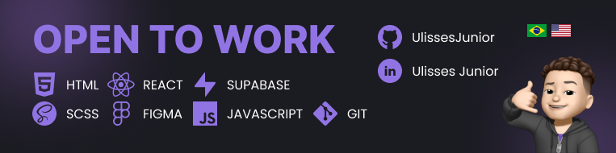

<h3>Hey Guys, I'm Ulisses Junior</h3>

- 💻 Front-End Developer / Web Designer
- 🇧🇷 I'm 18 years old
- 📚 Technical degree in Industrial Automation 
- 🎓 Since 2023, I'm pursuing a degree in Control and Automation Engineering at UNIFEI (Universidade Federal de Itajubá).
- 📍 Aparecida-SP

  <h3>My Technologies</h3>

  
  
  
   
   

     

        <a target="_blank">
        <a target="_blank">
        <a target="_blank">
        <a target="_blank">
        
  

     
     
     
     </a> 
  

  <h3>Social Networks</h3>

 
  
  
  
  
  
  

  <h3>Github Stats</h3>

 
  
  

