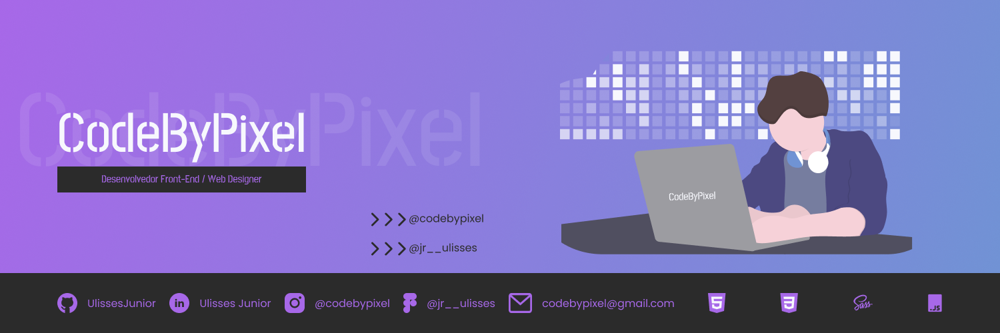

<h3>Hey Guys, I'm Ulisses Junior</h3>

- 💻 Front-End Developer / Web Designer
- 🇧🇷 I'm 16 years old
- 📚 Since 2020 I study at CTIG-UNESP, currently I am in the third year
- 📍 Aparecida-SP

<h3>My Technologies</h3>

  

<a target="_blank">

  

<h3>Social Networks</h3>

 

<h3>Github Stats</h3>

 

